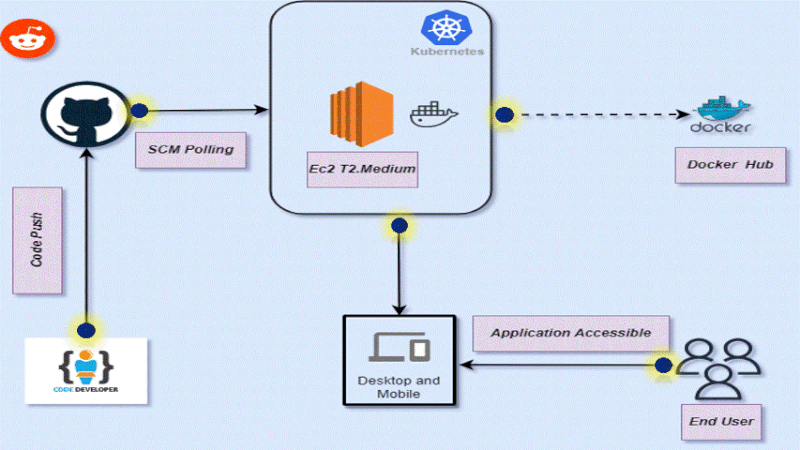
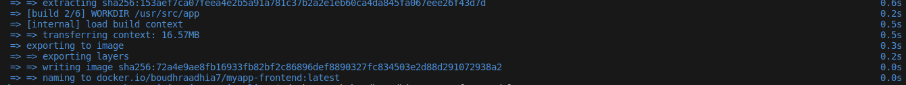
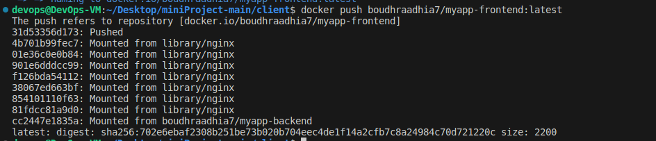
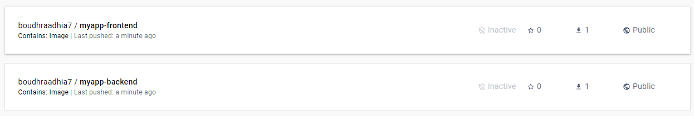
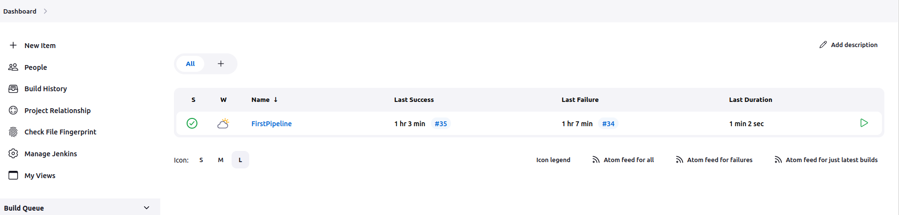
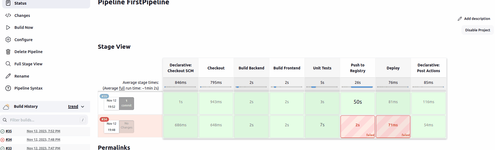

# Mini DevOps Project
## Overview

This mini-project demonstrates a full DevOps pipeline, including Docker containerization, Jenkins CI/CD, basic unit testing, and Kubernetes deployment for a web application with separate backend and frontend components.


## Dockerization

### Backend Dockerfile

```shell
    # Starting from a node base image
    FROM node:18-alpine

    # Set the working directory in the container
    WORKDIR /usr/src/app

    # Copy package.json and package-lock.json
    COPY package*.json ./

    # Install dependencies
    RUN npm install


    # Copy the rest of the application code
    COPY . .

    # Expose the port the app runs on
    EXPOSE 3001

    # Command to run the app
    CMD [ "node", "index.js" ]

```

### Frontend Dockerfile

```shell
    # Starting from a node base image
    FROM node:18-alpine as build

    # Set the working directory in the container
    WORKDIR /usr/src/app

    # Copy package.json and package-lock.json
    COPY package*.json ./

    # Install dependencies
    RUN npm install

    # Copy the rest of the frontend code
    COPY . .

    # Build the application
    RUN npm run build

    # Start a new stage from nginx to serve the static files
    FROM nginx:alpine

    # Copy static assets from builder stage
    COPY --from=build /usr/src/app/build /usr/share/nginx/html

    # Expose port 80 to access the container
    EXPOSE 80

    # No need for CMD because it's included in the nginx base image


```




## Jenkins Pipeline

The Jenkins Pipeline automates the process of building Docker images for both the backend and frontend, running unit tests, and pushing the images to a Docker registry. The pipeline is defined in a `Jenkinsfile`, which contains multiple stages to handle different parts of the process.

### Pipeline Stages

1. **Checkout**: The pipeline checks out the code from the GitHub repository.

2. **Build Backend**: This stage builds the Docker image for the backend from the Dockerfile located in the `/server` directory.

    ```groovy
   stage('Build Backend') {
        steps {
            script {
                dir('server') {
                    sh 'ls -la' // Lists all files in the server directory
                    sh 'docker build -t boudhraadhia7/myapp-backend .'
                }
            }
        }
    }
    ```

3. **Build Frontend**: Similar to the backend, this stage builds the Docker image for the frontend from the Dockerfile in the `/client` directory.

    ```groovy
      stage('Build Frontend') {
        steps {
            script {
                dir('client') {
                    sh 'ls -la' // Lists all files in the server directory
                    sh 'docker build -t boudhraadhia7/myapp-frontend .'
                }
            }
        }
    }
    ```

4. **Unit Tests**: Runs unit tests for both backend and frontend. The tests are located in their respective directories.

    ```groovy
    stage('Unit Tests') {
        steps {
            script {
                dir('client') {
                   sh 'ls -la' // Lists all files in the server directory
                   sh 'npm test'
                }
            }
            script {
                dir('server') {
                   sh 'npm test'
                }
            }
            sh 'echo "Unit tests passed"'
        }
    }
    ```

5. **Push to Registry**: This stage logs into Docker Hub and pushes both backend and frontend images to the Docker registry.

    ```groovy
    stage('Push to Registry') {
        steps {
            script {
                docker.withRegistry('https://registry.hub.docker.com', 'dockerHubCredentials') {
                    docker.image("myapp-backend:latest").push()
                    docker.image("myapp-frontend:latest").push()
                }
            }
        }
    }
    ```
    


6. **Deploy**: In this stage, the application is deployed to a Kubernetes cluster using kubectl commands.

    ```groovy
    stage('Deploy') {
        steps {
            sh 'kubectl apply -f k8s-manifest.yaml'
        }
    }
    ```

### Jenkinsfile

The `Jenkinsfile` is located at the root of the repository and is configured as a Declarative Pipeline in Jenkins.



### Pipeline Execution

The pipeline is triggered on each commit to the repository, ensuring that every change is automatically built, tested, and ready for deployment.




### Deployment Process

Explain the steps for deploying the application on Kubernetes, including setting up the environment, applying Kubernetes manifests, and verifying the deployment.

```bash
# Kubernetes deployment commands
kubectl apply -f k8s-manifest.yaml
```

## Kubernetes Deployment

This project is configured for deployment on a Kubernetes cluster, ensuring scalable and efficient distribution of resources. Below are the steps and configurations used for deploying the backend and frontend services on Kubernetes.

### Kubernetes Configurations

1. **Kubernetes YAML Files**: 
   - `backend-deployment.yaml`: This file contains the deployment configuration for the backend service. It defines the Docker image to use, the number of replicas, and other necessary specifications for running the backend.
   - `frontend-deployment.yaml`: Similar to the backend, this file outlines the deployment details for the frontend service, including the Docker image, replicas, and other vital settings.
   - `service.yaml`: This file defines the Kubernetes services that expose the backend and frontend deployments, making them accessible within the Kubernetes cluster.

2. **Deployment Process**:
   - **Applying Configurations**: Run `kubectl apply -f backend-deployment.yaml` and `kubectl apply -f frontend-deployment.yaml` to deploy the backend and frontend services to the Kubernetes cluster.
   - **Service Exposure**: Execute `kubectl apply -f service.yaml` to create the services that expose your deployments.

3. **Monitoring and Management**:
   - **Kubernetes Dashboard**: The Kubernetes Dashboard is a useful tool for monitoring the state of deployments and services. It provides a user-friendly interface to interact with your Kubernetes cluster.
   - **Kubectl Commands**: Regularly use `kubectl` commands like `kubectl get pods`, `kubectl describe pod `, and `kubectl logs` to monitor and debug the deployed services.


### Cleanup

- To remove the deployed services and clean up your Kubernetes cluster, run `kubectl delete -f backend-deployment.yaml`, `kubectl delete -f frontend-deployment.yaml`, and `kubectl delete -f service.yaml`.

---
This section outlines the basic steps for deploying the application on Kubernetes. For more detailed instructions or troubleshooting, refer to the official [Kubernetes documentation](https://kubernetes.io/docs/).

## Conclusion

This project showcases a complete CI/CD pipeline using Jenkins, Docker, and Kubernetes, demonstrating the capabilities of modern DevOps practices.

