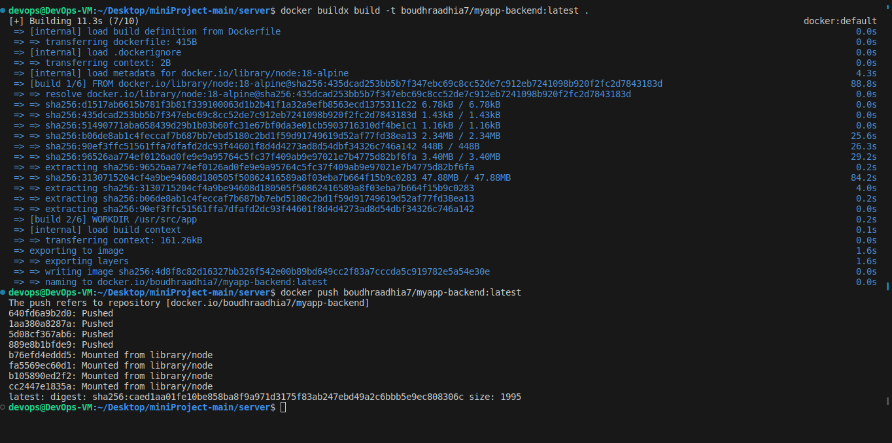

# Mini DevOps Project

## Overview

This mini-project demonstrates a full DevOps pipeline, including Docker containerization, Jenkins CI/CD, basic unit testing, and Kubernetes deployment for a web application with separate backend and frontend components.

## Dockerization

### Backend Dockerfile

```shell
    # Starting from a node base image
    FROM node:18-alpine

    # Set the working directory in the container
    WORKDIR /usr/src/app

    # Copy package.json and package-lock.json
    COPY package*.json ./

    # Install dependencies
    RUN npm install


    # Copy the rest of the application code
    COPY . .

    # Expose the port the app runs on
    EXPOSE 3001

    # Command to run the app
    CMD [ "node", "index.js" ]

```

### Frontend Dockerfile

```shell
    # Starting from a node base image
    FROM node:18-alpine as build

    # Set the working directory in the container
    WORKDIR /usr/src/app

    # Copy package.json and package-lock.json
    COPY package*.json ./

    # Install dependencies
    RUN npm install

    # Copy the rest of the frontend code
    COPY . .

    # Build the application
    RUN npm run build

    # Start a new stage from nginx to serve the static files
    FROM nginx:alpine

    # Copy static assets from builder stage
    COPY --from=build /usr/src/app/build /usr/share/nginx/html

    # Expose port 80 to access the container
    EXPOSE 80

    # No need for CMD because it's included in the nginx base image


```


## Jenkins Pipeline

... [Previous content]

## Kubernetes Deployment

The application is deployed on a Kubernetes cluster, ensuring high availability and scalability.

### Kubernetes Architecture

Briefly describe the Kubernetes architecture used, including any services, deployments, and pods.


### Deployment Process

Explain the steps for deploying the application on Kubernetes, including setting up the environment, applying Kubernetes manifests, and verifying the deployment.

```bash
# Kubernetes deployment commands
kubectl apply -f k8s-manifest.yaml
